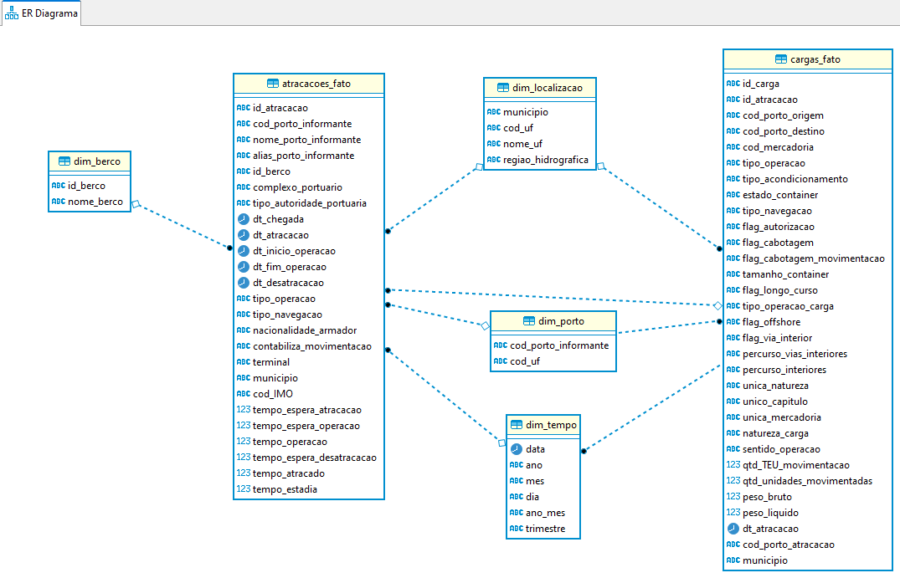

#  Prova Prática Engenharia de Dados e DevOps

Atividade prática proposta pelo OBSERVATÓRIO DA INDÚSTRIA da FIEC (Federação das indústrias do estado do Ceará)

## Objetivo
* Trabalhar as informações dos últimos 3 anos sobre atracações e cargas realizadas nos portos brasileiros
* Disopnibilizar em um Datalake os dados
* Disopnibilizar em tabelas do Microsoft SQL Server os dados
* Desenvolver rotinas em python para realização do ETL (extração, transformação e carga) dos dados
* Disponibilizar os dados em um Datawarehouse no MSSQL Server
* Criar automação dos processos utilizando o Airflow para processametno mensal
* Criar consulta otimizada para permitir uma análise de tempo de espera nos portos
* Criacão do ambiente de desenvolimento usando Docker

## Tecnologias utilizadas
* Python
* Airflow
* MinIO
* Spark
* PostgreSQL
* MS Sql Server
* Jupyter Lab
* Docker
* Git

## Estrutura do projeto
* diretório <code>/antaq-etl</code> contém os scripts Python que criam os pipelines de dados
* diretório <code>/antaq-infra</code> contém os aruivos necessários para provisionar a infraestrutura para o projeto
dos dados gerados pelo processamento.
* diretório <code>/antaq-notebooks</code> contém os arquivos de notebooks para execução manual dos pipelines de dados
* diretório <code>/antaq-scripts-sql</code> contém os scripts para criação das estruturas do banco de dados OLTP e do 
Datawarehouse. O processamento com o Pyspark cria as tabelas ao salvar, não sendo obrigatório criar as tabelas previamente.

### Modelagem dimensional dos Datawarehouse
Como parte do processo de modelagem dos dados, os nomes das colunas originais passaram por um processo de normalização,
afim de dar maior clareza para quem consumir os dados evitar problemas com caracteres especiais e espaços. 
Foi adotado também a modelagem de esquema estrela (Star Schema) para otimizar os dados no Datawarehouse.

