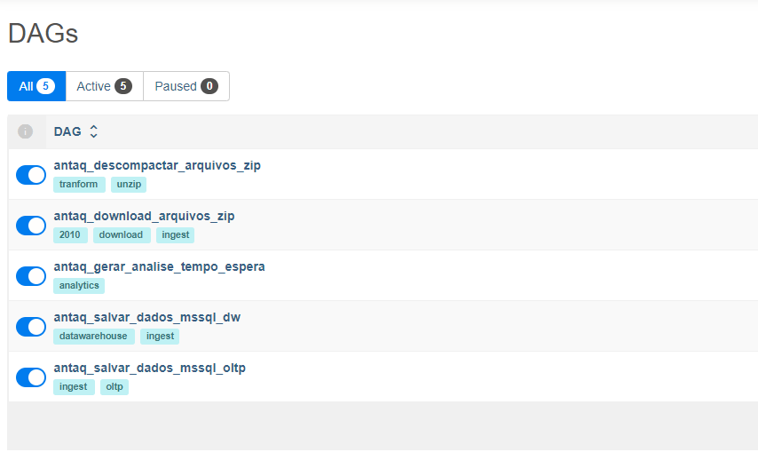

# Rotinas de ETL e automação

## Instruções de uso do projeto
* Copie o conteúdo deste diretório para o diretório de DAGs do servidor de Schedule do Airflow.
* Atualize as varíáveis de ambiente do arquivo <code>.env.dev</code>. Caso queira utilizar em produção crie um arquivo 
<code>.env</code> com base no <code>.env.example</code>
* Se tudo der certo, aparecerá na lista de Dags do Airflow conforme imagem abaixo:

